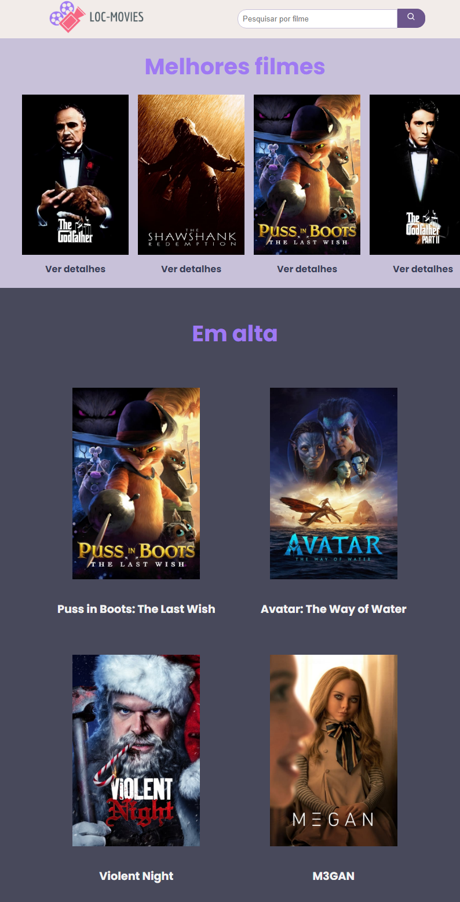

## **<h2 align="center"> Loc-Movies 📽️</h2>**

## :pushpin: Sobre este projeto:
Trata-se de uma aplicação onde o usuário pode visualizar os filmes e seus detalhes, podendo pesquisar por filmes por meio de seus títulos. Foi desenvolvido com ReactJs e Styled-Components, onde foi consumido uma API de filmes.

 

## :rocket: Tecnologias usadas:

  

 

## :star: Tela principal da aplicação

  

 

<h3 align="center"> 
	Application status: Developed ✔️
</h3>
 

## :information_source: Application installation
- `https://github.com/IgorPierre/locadora_filmes_com_react.git` to clone the repository

 
